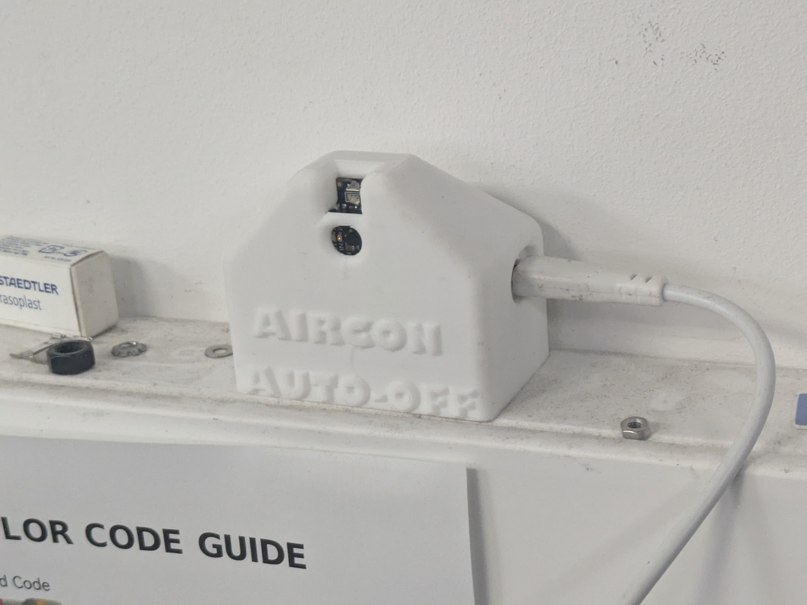

# **Aircon Auto-Off**

A tiny, standalone IR transmitter that automatically sends the “OFF” command to the Hackspace air conditioner at regular intervals.  
Designed to prevent the AC unit being left on accidentally.

Powered by a Raspberry Pi Pico WH and an Adafruit IR transceiver module, this device replays the exact infrared OFF signal captured by **David Turner** and published at:

🔗 https://wiki.hackhitchin.org.uk/index.php?title=User:DavidTurner  




---

## **Features**

- Sends the AC “OFF” IR command periodically (default: once per hour)
- Uses **hardware-timed PIO** via the `micropython-ir` library for reliable IR modulation
- 100% offline — no Wi-Fi or internet required
- Runs indefinitely on USB power
- Compact, neat **3D-printed enclosure**
- Simple wiring thanks to the Adafruit IR module with built-in driver transistor

---

## **Hardware Used**

- **Raspberry Pi Pico WH**
- **Adafruit Infrared Transceiver Module**  
  (IR LED + receiver + transistor + resistors onboard)
- **The Pi Hut STEMMA JST-PH 4-pin to female header cable**
- USB Micro-B cable  
- USB wall power adapter  
- 3D-printed housing (CAD included in repo)

---

## **Wiring**

The Adafruit IR board includes the correct transistor/resistor network, so it connects directly to the Pico:

| Pico Pin | IR Module | Function |
|---------|-----------|----------|
| **3V3** | VIN       | Module power |
| **GND** | GND       | Ground |
| **GPIO 16** | OUT (receiver) | IR input *(not used)* |
| **GPIO 17** | IN (transmitter) | IR output |

The IR LED faces outward through the enclosure toward the AC unit.

---

## **Repository Contents**

```
/
├── README.md           ← you are here
├── main.py             ← MicroPython script that sends the OFF IR code periodically
├── ir_tx/              ← micropython-ir library folder (copied from Peter Hinch repo)
│   ├── __init__.py
│   ├── rp2_rmt.py
│   └── ...
└── CAD/                ← CAD source and printing files
    ├── main enclosure.step
    └── ...
```

### **main.py**
- Contains the raw OFF pulse train captured from the original AC remote  
- Configurable interval (`OFF_INTERVAL_SECONDS`)
- Uses `Player` class from `micropython-ir` to replay precise IR timings

### **ir_tx/**
- Local copy of Peter Hinch’s `micropython-ir` library  
- Handles pulse timing using RP2040 PIO

### **enclosure/**
- STL, STEP and CAD files for the 3D-printed housing  
- Ensures the IR LED points correctly at the AC unit

---

## **How It Works**

1. The AC OFF command is stored as a list of microsecond durations:  
   `[mark, space, mark, space, ...]`
2. `micropython-ir` generates the pulses matching these timings exactly.
3. The device loops indefinitely:
   - Send OFF pulse train  
   - `sleep(interval)`  
   - Repeat  

---

## **Installation**

1. Flash MicroPython to the Pico WH  
2. Copy `main.py` and the `ir_tx/` folder into the Pico’s root directory  
3. Connect the IR module using the JST-PH cable  
4. Place inside the 3D-printed case  with M2 caphead screws
5. Power using USB wall adapter  

The unit will immediately begin sending the OFF command at your chosen interval.

---

## **Credits**

- **Original IR capture:**  
  David Turner – https://wiki.hackhitchin.org.uk/index.php?title=User:DavidTurner  
- **IR library:**  
  Peter Hinch’s *micropython-ir*  
- **Hackspace:**  
  Hitchin Hackspace  


